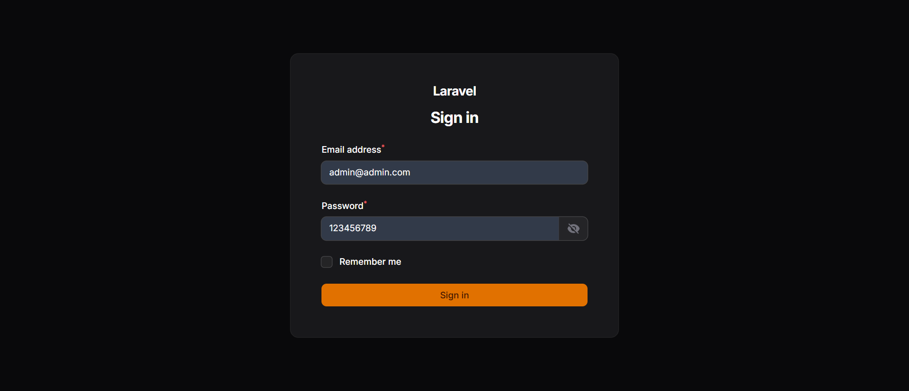
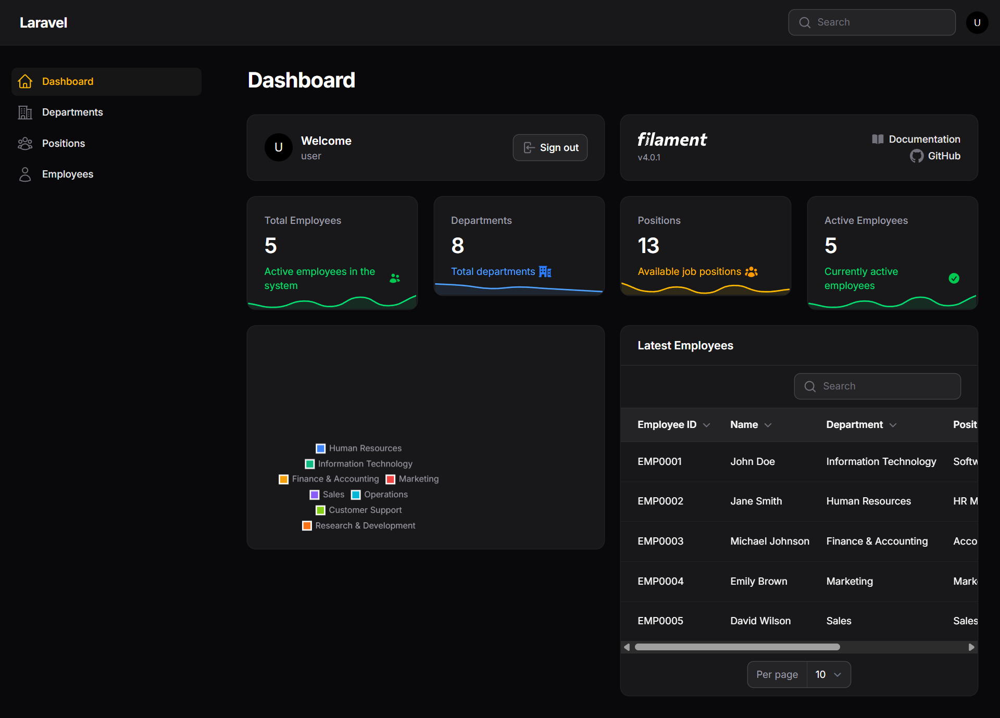
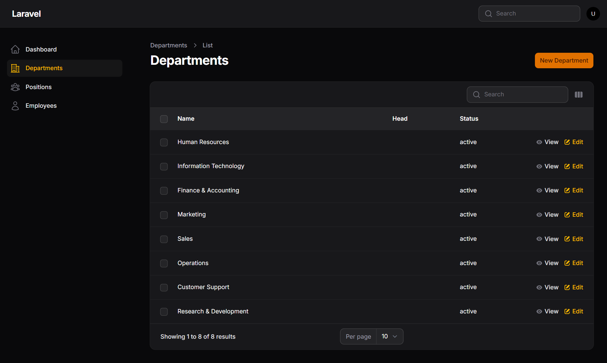
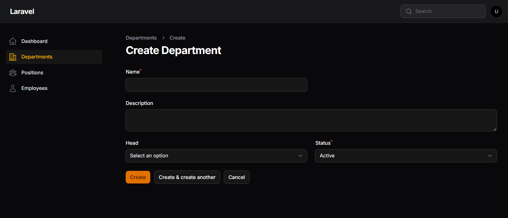

# 🏢 Laravel Filament Payroll Management System

[](https://laravel.com)
[](https://filamentphp.com)
[](https://php.net)
[](LICENSE)
[](https://github.com/yourusername/laravel-filament-payroll)
[](https://github.com/yourusername/laravel-filament-payroll)
[](https://github.com/yourusername/laravel-filament-payroll/issues)
[](https://github.com/yourusername/laravel-filament-payroll/pulls)
[](https://github.com/yourusername/laravel-filament-payroll/graphs/contributors)
[](https://github.com/yourusername/laravel-filament-payroll/commits/main)

> **🚀 Complete Payroll Management System Built with Laravel 12 & Filament 4.0**  
> **💼 Perfect for HR Departments, Small Businesses, and Enterprise Solutions**  
> **⚡ Modern Admin Panel with Real-time Analytics and Reporting**

## 📋 Table of Contents

-   [✨ Features](#-features)
-   [🎯 Demo & Screenshots](#-demo--screenshots)
-   [🚀 Quick Start](#-quick-start)
-   [📦 Installation](#-installation)
-   [🏗️ Architecture](#️-architecture)
-   [📊 Database Schema](#-database-schema)
-   [🎨 Admin Panel](#-admin-panel)
-   [🔧 Configuration](#-configuration)
-   [🧪 Testing](#-testing)
-   [📦 Deployment](#-deployment)
-   [🤝 Contributing](#-contributing)
-   [📄 License](#-license)
-   [🙏 Acknowledgments](#-acknowledgments)

## ✨ Features

### 👥 **Employee Management**

-   **Complete Employee Profiles** - Personal info, employment details, salary structure
-   **Department Management** - Organize employees by departments with hierarchy
-   **Position Management** - Define job roles, titles, and salary grades
-   **Document Management** - Store and manage employee documents securely
-   **Bank Account Details** - Salary disbursement information
-   **Emergency Contacts** - Contact information for emergencies

### ⏰ **Attendance Tracking**

-   **Daily Attendance** - Check-in/check-out with time tracking
-   **Overtime Calculation** - Automatic overtime computation
-   **Leave Management** - Comprehensive leave application and approval system
-   **Holiday Calendar** - Manage company holidays and working days

### 💰 **Payroll Processing**

-   **Salary Structure** - Flexible salary components (Basic, HRA, DA, Allowances)
-   **Tax Calculation** - Automatic tax deductions and TDS calculation
-   **Deduction Management** - PF, insurance, loans, and other deductions
-   **Salary Slip Generation** - Professional PDF salary slips
-   **Payroll Reports** - Detailed monthly and annual reports

### 📊 **Analytics & Reports**

-   **Dashboard Analytics** - Real-time insights and statistics
-   **Attendance Reports** - Daily, monthly, and custom period reports
-   **Payroll Reports** - Comprehensive salary and tax reports
-   **Export Functionality** - PDF and Excel export capabilities

### ⚙️ **System Administration**

-   **Role-based Access Control** - Secure user permissions
-   **System Configuration** - Tax rates, PF rates, working hours
-   **Data Backup** - Automated backup and recovery
-   **Audit Trail** - Complete activity logging

## 🎯 Demo & Screenshots

### 🔐 **Secure Login System**



_Modern, secure login interface with dark theme design. Features email/password authentication with remember me functionality._

### 📊 **Dashboard Overview**



_Comprehensive dashboard showing key metrics including total employees (5), departments (8), positions (13), and active employees (5). Features department distribution charts and latest employee listings._

### 🏢 **Department Management**



_Complete department listing with search functionality, showing 8 departments including Human Resources, Information Technology, Finance & Accounting, Marketing, Sales, Operations, Customer Support, and Research & Development._

### ➕ **Create Department Form**



_Intuitive form for creating new departments with fields for name, description, department head selection, and status management. Features modern dark theme UI with validation._

### 🎨 **Key Interface Features**

-   **Dark Theme Design** - Modern, eye-friendly dark mode interface
-   **Responsive Layout** - Works seamlessly on desktop, tablet, and mobile devices
-   **Intuitive Navigation** - Easy-to-use sidebar navigation with clear icons
-   **Search Functionality** - Quick search across all modules
-   **Real-time Updates** - Live data updates without page refresh
-   **Professional UI** - Clean, modern interface built with Tailwind CSS

### 📱 **Mobile Responsive**

The system is fully responsive and works perfectly on:

-   📱 Mobile phones
-   📱 Tablets
-   💻 Desktop computers
-   🖥️ Large displays

## 🚀 Quick Start

### ⚡ **5-Minute Setup**

1. **Clone & Install**

    ```bash
    git clone https://github.com/yourusername/laravel-filament-payroll.git
    cd laravel-filament-payroll
    composer install
    npm install && npm run build
    ```

2. **Environment Setup**

    ```bash
    cp .env.example .env
    php artisan key:generate
    ```

3. **Database Setup**

    ```bash
    php artisan migrate --seed
    ```

4. **Start Application**

    ```bash
    php artisan serve
    ```

5. **Access Admin Panel**
    - URL: `http://localhost:8000/admin`
    - Email: `admin@admin.com`
    - Password: `123456789`

### 🎯 **Default Login Credentials**

| Role  | Email           | Password  |
| ----- | --------------- | --------- |
| Admin | admin@admin.com | 123456789 |

### 📊 **Sample Data**

The system comes pre-loaded with:

-   5 sample employees
-   8 departments
-   13 positions
-   Sample attendance records
-   Demo payroll data

### Prerequisites

-   PHP 8.2 or higher
-   Composer
-   Node.js & NPM
-   MySQL/PostgreSQL or SQLite

### Installation

1. **Clone the repository**

    ```bash
    git clone https://github.com/yourusername/laravel-filament-payroll.git
    cd laravel-filament-payroll
    ```

2. **Install PHP dependencies**

    ```bash
    composer install
    ```

3. **Install Node.js dependencies**

    ```bash
    npm install
    ```

4. **Environment setup**

    ```bash
    cp .env.example .env
    php artisan key:generate
    ```

5. **Database setup**

    ```bash
    php artisan migrate
    php artisan db:seed
    ```

6. **Build assets**

    ```bash
    npm run build
    ```

7. **Start the development server**

    ```bash
    php artisan serve
    ```

8. **Access the application**
    - **Admin Panel**: `http://localhost:8000/admin`
    - **Default Admin**: `admin@example.com` / `password`

## 📦 Installation

### **Option 1: Quick Install (Recommended)**

```bash
# One-liner installation
curl -s https://raw.githubusercontent.com/yourusername/laravel-filament-payroll/main/install.sh | bash
```

### **Option 2: Manual Installation**

```bash
# Clone repository
git clone https://github.com/yourusername/laravel-filament-payroll.git

# Navigate to project
cd laravel-filament-payroll

# Install dependencies
composer install --no-dev --optimize-autoloader
npm install && npm run build

# Setup environment
cp .env.example .env
php artisan key:generate

# Configure database
php artisan migrate --force
php artisan db:seed

# Set permissions
chmod -R 775 storage bootstrap/cache
```

### **Option 3: Docker Installation**

```bash
# Clone repository
git clone https://github.com/yourusername/laravel-filament-payroll.git

# Start with Docker
docker-compose up -d

# Run migrations
docker-compose exec app php artisan migrate --seed
```

## 🏗️ Architecture

### **Technology Stack**

-   **Backend Framework**: Laravel 12 (PHP 8.2+)
-   **Admin Panel**: Filament 4.0
-   **Database**: MySQL/PostgreSQL/SQLite
-   **Frontend**: Livewire + Alpine.js + Tailwind CSS
-   **Authentication**: Laravel Breeze/Filament Auth
-   **PDF Generation**: DomPDF
-   **Excel Export**: Laravel Excel

### **System Requirements**

#### **Minimum Requirements**

-   PHP 8.2 or higher
-   MySQL 8.0+ / PostgreSQL 13+ / SQLite 3
-   Composer 2.0+
-   Node.js 18+ and NPM
-   Web server (Apache/Nginx)

#### **Recommended Requirements**

-   PHP 8.3+
-   MySQL 8.0+ with InnoDB
-   Redis for caching
-   2GB+ RAM
-   SSD storage

### **Browser Support**

-   ✅ Chrome 90+
-   ✅ Firefox 88+
-   ✅ Safari 14+
-   ✅ Edge 90+
-   ✅ Mobile browsers (iOS Safari, Chrome Mobile)

### **Core Modules**

1. **Employee Management** - Complete employee lifecycle management
2. **Attendance System** - Time tracking and leave management
3. **Payroll Processing** - Salary calculation and disbursement
4. **Reports & Analytics** - Business intelligence and reporting
5. **System Administration** - Configuration and user management

## 📊 Database Schema

### **Key Tables**

-   `users` - User authentication and profiles
-   `employees` - Employee information and details
-   `departments` - Department management
-   `positions` - Job positions and roles
-   `attendances` - Daily attendance records
-   `leaves` - Leave applications and approvals
-   `payrolls` - Monthly payroll records
-   `salary_components` - Salary structure configuration
-   `deductions` - Deduction records
-   `holidays` - Holiday calendar
-   `settings` - System configuration

## 🎨 Admin Panel

### **Dashboard Features**

-   Employee count by department
-   Recent attendance statistics
-   Payroll summary
-   Leave requests pending approval
-   Quick action buttons

### **Employee Management**

-   Employee listing with search and filters
-   Detailed employee profiles
-   Document upload and management
-   Salary structure configuration
-   Employment history tracking

### **Attendance Management**

-   Daily attendance tracking
-   Bulk attendance entry
-   Overtime calculation
-   Leave application workflow
-   Attendance reports

### **Payroll Processing**

-   Monthly payroll generation
-   Salary slip generation
-   Tax calculation
-   Deduction management
-   Payroll reports

## 🔧 Configuration

### **Environment Variables**

```env
# Database Configuration
DB_CONNECTION=mysql
DB_HOST=127.0.0.1
DB_PORT=3306
DB_DATABASE=payroll_system
DB_USERNAME=root
DB_PASSWORD=

# Mail Configuration
MAIL_MAILER=smtp
MAIL_HOST=smtp.mailtrap.io
MAIL_PORT=2525
MAIL_USERNAME=null
MAIL_PASSWORD=null
MAIL_ENCRYPTION=null

# File Storage
FILESYSTEM_DISK=local
```

### **Customization**

-   **Company Information**: Update in settings
-   **Tax Rates**: Configure in system settings
-   **Working Hours**: Set default working hours
-   **Holiday Calendar**: Add company holidays

## 🧪 Testing

### **Run Tests**

```bash
# Run all tests
php artisan test

# Run specific test suite
php artisan test --filter=EmployeeTest

# Run with coverage
php artisan test --coverage
```

### **Test Coverage**

-   Unit tests for models and services
-   Feature tests for CRUD operations
-   Integration tests for payroll calculations
-   Browser tests for user workflows

## 📦 Deployment

### **Production Setup**

1. **Server Requirements**

    - PHP 8.2+
    - MySQL 8.0+ or PostgreSQL 13+
    - Nginx/Apache
    - SSL Certificate

2. **Environment Configuration**

    ```bash
    APP_ENV=production
    APP_DEBUG=false
    DB_CONNECTION=mysql
    CACHE_DRIVER=redis
    QUEUE_CONNECTION=redis
    ```

3. **Deployment Commands**
    ```bash
    composer install --optimize-autoloader --no-dev
    php artisan config:cache
    php artisan route:cache
    php artisan view:cache
    php artisan migrate --force
    ```

### **Deployment Platforms**

-   **Vercel**: [Deploy to Vercel](https://vercel.com)
-   **Heroku**: [Deploy to Heroku](https://heroku.com)
-   **DigitalOcean**: [Deploy to DigitalOcean](https://digitalocean.com)
-   **AWS**: [Deploy to AWS](https://aws.amazon.com)

## 🤝 Contributing

We welcome contributions! Please see our [Contributing Guide](CONTRIBUTING.md) for details.

### **How to Contribute**

1. Fork the repository
2. Create your feature branch (`git checkout -b feature/amazing-feature`)
3. Commit your changes (`git commit -m 'Add some amazing feature'`)
4. Push to the branch (`git push origin feature/amazing-feature`)
5. Open a Pull Request

### **Development Setup**

```bash
# Fork and clone
git clone https://github.com/yourusername/laravel-filament-payroll.git

# Install dependencies
composer install
npm install

# Setup development environment
cp .env.example .env
php artisan key:generate
php artisan migrate --seed

# Start development
npm run dev
php artisan serve
```

## 📄 License

This project is licensed under the MIT License - see the [LICENSE](LICENSE) file for details.

## 🙏 Acknowledgments

-   [Laravel Team](https://laravel.com) for the amazing framework
-   [Filament Team](https://filamentphp.com) for the powerful admin panel
-   [Tailwind CSS](https://tailwindcss.com) for the beautiful UI components
-   [Alpine.js](https://alpinejs.dev) for the reactive JavaScript framework

## 📞 Support

-   **Documentation**: [Full Documentation](https://docs.payroll-system.com)
-   **Issues**: [GitHub Issues](https://github.com/yourusername/laravel-filament-payroll/issues)
-   **Discussions**: [GitHub Discussions](https://github.com/yourusername/laravel-filament-payroll/discussions)
-   **Email**: support@payroll-system.com

## 🌟 Star History

[](https://star-history.com/#yourusername/laravel-filament-payroll&Date)

---

**⭐ If this project helps you, please give it a star on GitHub!**

**Built with ❤️ using Laravel & Filament**

_For detailed project planning and implementation steps, see [STEPS.md](STEPS.md)_
